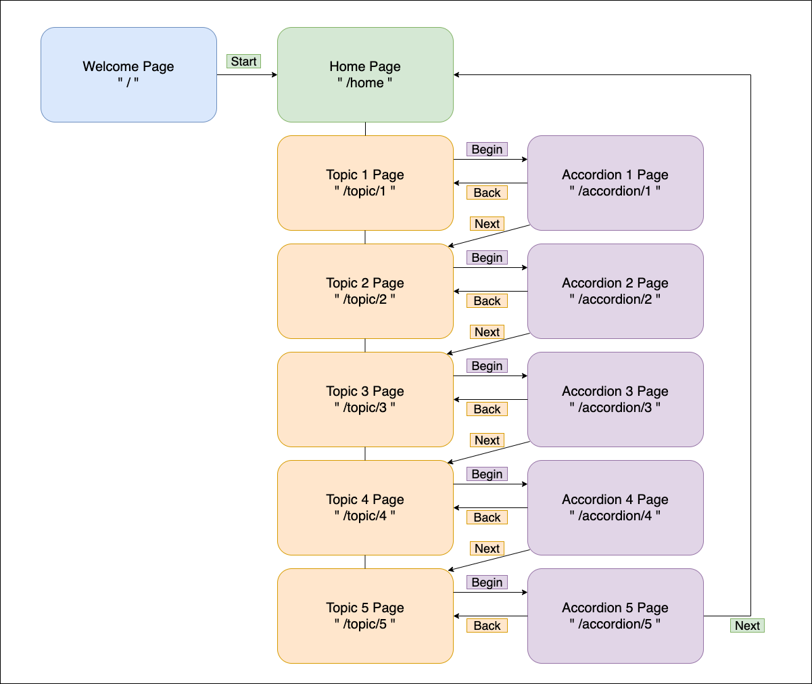

# Installation

Under the root directory, run 'npm install'
 
 
 

# Running the App

1. Run 'npm start' after installation successfully completes;
2. Copy and paste 'http://localhost:3000' to your browser.
3. Enjoy the App!
    
    
    

# Flow chart

